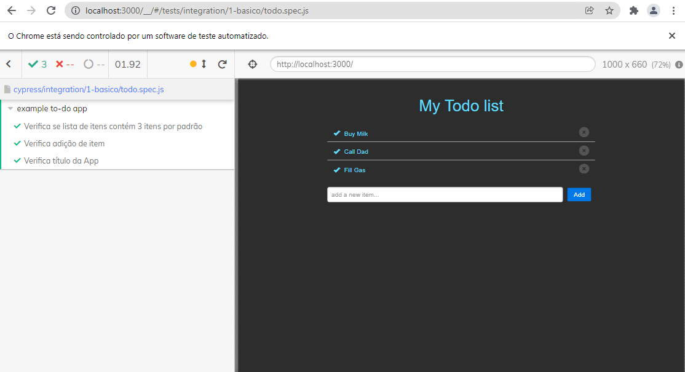

# Testes E2E com Cypress

Exemplo de aplicação React com Cypress.io



## Instalação

```bash
git clone https://github.com/lyndontavares/react-cypress-todo-list
cd react-cypress-todo-list
yarn install
```

Adicionar Cypress

```bash
yarn add --dev cypress
```

## Iniciar App e Cypress

```bash
npm run start
yarn cypress open
```

## Github

https://github.com/lyndontavares/react-cypress-todo-list
